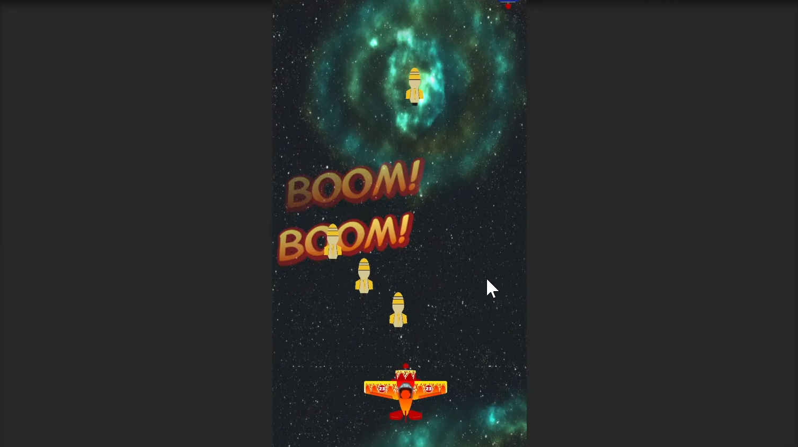

# Research-ShootingSpaceShip

## Preview

---

## Introduction

> Unity 엔진을 사용해 2D 상하 스크롤 슈팅 게임을 구현하였다.
> 플레이어는 우주선을 조작해 적을 피하고 총알을 발사하여 적을 파괴한다.
> 적이 파괴되면 폭발 이펙트와 함께 점수가 오르며, 게임 최고 점수는 저장된다.
> 무작위로 적의 이동 방향을 변경하여 예측 불가한 움직임을 구현하였다.

---

## 기술 및 학습 내용

| 구분 | 내용 |
|------|------|
| Prefab 생성 및 Instantiate() 활용 | 총알, 적, 폭발 효과를 프리팹으로 관리하고 동적으로 생성 |
| Input System으로 입력 처리 | UnityEngine.InputSystem을 사용하여 키보드 및 버튼 입력 처리 |
| Vector3, Vector2로 방향 제어 | 플레이어 이동 및 적의 방향을 벡터로 계산 |
| AudioSource로 효과음 재생 | 적 파괴 시 폭발 사운드를 재생 |
| 충돌 처리 및 태그 관리 | OnCollisionEnter()와 OnTriggerEnter()를 통해 충돌 감지 및 파괴 |
| 랜덤 적 이동 로직 | 일정 확률로 적이 플레이어를 추적하도록 설정하여 동적 패턴 구현 |
| GameManager로 게임 상태 관리 | 점수 저장, UI 갱신, 효과음 관리 등 전체 게임 흐름 제어 |
| PlayerPrefs로 최고 점수 저장 | 최고 점수를 로컬에 저장하고 재시작해도 유지 |
| TextMeshPro로 UI 구현 | 현재 점수와 최고 점수를 실시간으로 갱신하여 표시 |
| 시간 기반 적 스폰 | 일정 시간 간격으로 적 생성, 난이도 조절에 사용 |
| DestroyZone으로 메모리 관리 | 카메라 밖으로 벗어난 오브젝트는 파괴하여 리소스 관리 |
| GameObject.Find() & GetComponent() | 오브젝트 간 통신 및 데이터 공유 처리 |

---

## 개선 아이디어

- 적마다 다른 이동 패턴 추가 (지그재그, 회전 등)
- 총알 연사 기능, 아이템 추가 (보호막, 스킬 등)
- 배경 음악 및 UI 애니메이션 도입
- 플레이어 체력 시스템 도입하여 명확한 게임 종료 조건 구성

---

## Requirements

> 프로젝트 실행 환경 및 버전 정보

| 항목 | 내용 |
|------|------|
| OS | Windows 11 |
| Engine | Unity 6000.0.58f1 |
| Language | C# |

---

## Summary

본 프로젝트를 통해 Unity의 2D 물리 시스템, 입력 시스템, UI 관리, 사운드 처리, GameManager 설계 등 핵심 요소를 실습할 수 있었다.
단순한 슈팅 게임이지만 게임 개발 전반에 필요한 기본 구조(Prefab 관리, 점수 시스템, 스폰 로직 등)를 모두 포함하고 있어 학습용으로 적합한 프로젝트였다.
